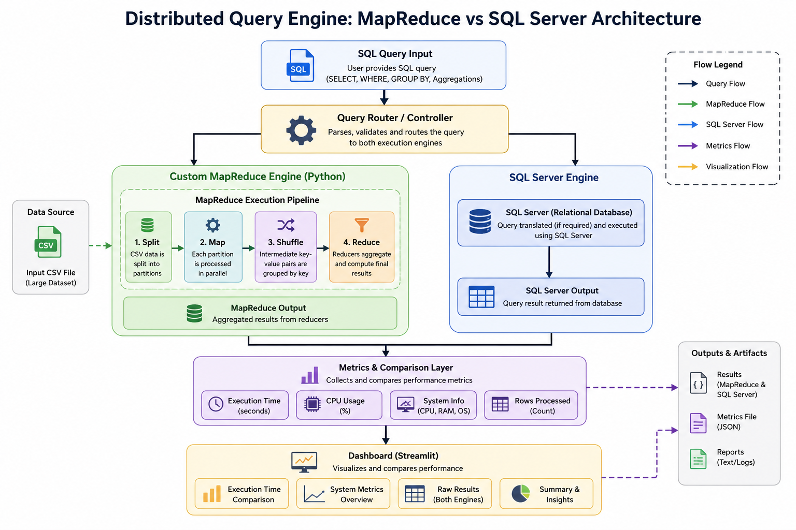

# 🚀 Distributed Query Engine: MapReduce vs SQL Server

---

## 📌 Overview

This project implements a **custom MapReduce-based query execution engine** and compares its performance with a traditional relational database (**SQL Server**).

The system executes the same SQL query across two fundamentally different paradigms:

* 🔹 **Custom MapReduce Engine (Python)**
* 🔹 **SQL Server Execution Engine**

It then collects **performance metrics** and visualizes them using an interactive dashboard.

---

## 🎯 Objective

To understand and demonstrate:

* How **distributed data processing systems** (like Hadoop) work internally
* How they compare with **optimized relational databases**
* The **trade-offs in performance, scalability, and execution design**

---

## 🏗️ System Architecture

### 🔹 High-Level Architecture



---

### 🔹 Execution Flow

```
SQL Input
   ↓
Query Router / Controller
   ↓                 ↓
MapReduce Engine     SQL Server
   ↓                 ↓
Execution Pipeline   Optimized DB Execution
   ↓                 ↓
      Metrics + Comparison Layer
                ↓
         Dashboard (Streamlit)
```

---

## ⚙️ Core Features

### 🔹 1. SQL Parsing Engine

* Converts SQL queries into an **Intermediate Representation (IR)**
* Supports:

  * `SELECT`
  * `WHERE`
  * `GROUP BY`
  * Aggregations: `COUNT`, `SUM`, `AVG`

---

### 🔹 2. Custom MapReduce Engine

Implements a full pipeline:

```
Split → Map → Shuffle → Reduce
```

* **Partition-based processing**
* **Reducer distribution**
* Simulates **parallel data processing**

---

### 🔹 3. SQL Server Integration

* Executes the same query using **SQL Server**
* Uses `pyodbc` for database connectivity
* Includes a **query translation layer** for compatibility

---

### 🔹 4. Metrics & Benchmarking System

Tracks:

* ⏱ Execution time
* ⚡ CPU usage
* 🧠 System specifications
* 📊 Rows processed

---

### 🔹 5. Interactive Dashboard (Streamlit)

* Visual comparison of both engines
* Bar charts for execution time
* System & execution insights

---

## 🧪 Sample Query

```sql
SELECT Score, COUNT(*), SUM(Score), AVG(Score)
FROM data
WHERE Score > 1
GROUP BY Score;
```

---

## 📊 Results

### 🔹 MapReduce Output

```
Score         COUNT         SUM           AVG
--------------------------------------------------------
1             156804        428892        2.7352
2             89307         166023        1.8590
3             127920        217587        1.7010
4             241965        336402        1.3903
5             1089366       1824936       1.6752
```

---

### 🔹 SQL Server Output

```
Score         COUNT         SUM           AVG
--------------------------------------------------------
1             156804        428892        2
2             89307         166023        1
3             127920        217587        1
4             241965        336402        1
5             1089366       1824936       1
```

---

### 🔹 Key Observation

> SQL Server performs **integer division in AVG by default**, while the custom MapReduce engine computes **floating-point averages**.

---

## 📁 Project Structure

```
Miniature MAP-REDUCE/
│
├── Data/
│   ├── Processed Data/
│   ├── Raw Data/
│
├── Data Processing Stage/
│   └── processor.ipynb
│
├── Results/
│   ├── metrics.json
│   └── report.txt
│
├── SQL/
│   ├── Queries.sql
│   └── test_cases.sql
│
├── Src/
│   │
│   ├── Analytics/
│   │   ├── __pycache__/
│   │   ├── dashboard.py
│   │   ├── metrics.py
│   │   └── report.py
│   │
│   ├── config/
│   │   ├── __pycache__/
│   │   ├── db_config.py
│   │   ├── paths.py
│   │   └── settings.py
│   │
│   ├── Execution_Engine/
│   │   ├── __pycache__/
│   │   ├── context.py
│   │   └── engine.py
│   │
│   ├── Map_Reduce/
│   │   ├── __pycache__/
│   │   ├── mapper.py
│   │   ├── reducer.py
│   │   ├── shuffle.py
│   │   └── splitter.py
│   │
│   ├── Optimizer/
│   │   ├── __pycache__/
│   │   └── optimizer.py
│   │
│   ├── Parser/
│   │   ├── __pycache__/
│   │   └── sql_parser.py
│   │
│   ├── SQL_Server/
│   │   ├── __pycache__/
│   │   ├── adapter.py
│   │   ├── connection.py
│   │   ├── executor.py
│   │   ├── loader.py
│   │   ├── metrics.py
│   │   └── translator.py
│   │
│   └── Utils/
│       ├── bootstrap.py
│       └── main.py
```

---

## ▶️ How to Run

### 1️⃣ Clone the repository

```bash
git clone <https://github.com/RiddhiDhara/Hadoop_Mini_Map_Reduce_Implementation>
cd Miniature MAP-REDUCE
```

---

### 2️⃣ Install dependencies

```bash
pip install -r requirements.txt
```

---

### 3️⃣ SQL SERVER MANAGEMENT STUDIO (SSMS) Set-up [ One Time ]

```bash
python bootstrap.py
```

### 4️⃣ Run the engine

```bash
cd Src
python main.py
```

---

### 5️⃣ Launch dashboard

```bash
streamlit run Analytics/dashboard.py
```

---

## ⚙️ Configuration

All configurations are centralized:

### 📁 `config/settings.py`

* Partitions
* Reducers
* Threads
* Engine toggles

### 📁 `config/paths.py`

* CSV path
* SQL query file
* Metrics & report paths

### 📁 `config/db_config.py`

* SQL Server connection details

---

## 🧠 Key Learnings

* Internals of **MapReduce processing**
* Query execution pipeline design
* Difference between:

  * Distributed systems
  * Relational databases
* Performance benchmarking techniques
* System modularization & architecture

---

## 📈 Results & Insights

* SQL Server is faster due to:

  * Query optimization
  * Execution planning
  * Internal indexing

* MapReduce provides:

  * Better conceptual scalability
  * Flexibility for distributed environments

---

## 🔮 Future Improvements

* Support for **JOIN operations**
* Multi-column `GROUP BY`
* True parallelism using `multiprocessing`
* Cost-based query optimizer
* Query caching
* Cloud deployment (AWS / Azure)

---

## 🧩 Tech Stack

* Python
* Pandas
* SQL Server
* pyodbc
* Streamlit

---

## 💡 Key Highlight

> This project demonstrates how the same query can be executed across two fundamentally different architectures and compares their performance using real metrics.

---

## 👤 Author

**Riddhi Dhara**  
Software Engineer

---

## ⭐ If you found this useful

Give it a ⭐ on GitHub and share your feedback!
